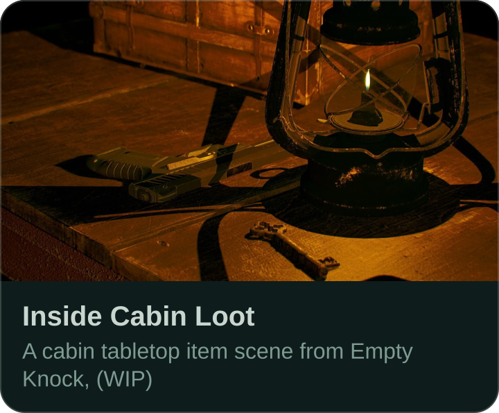
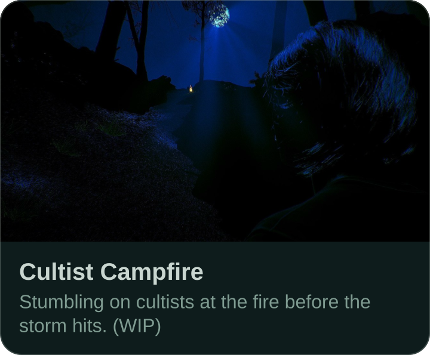
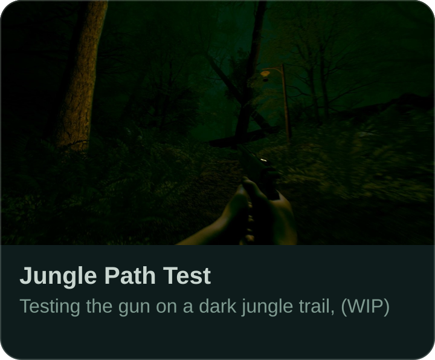
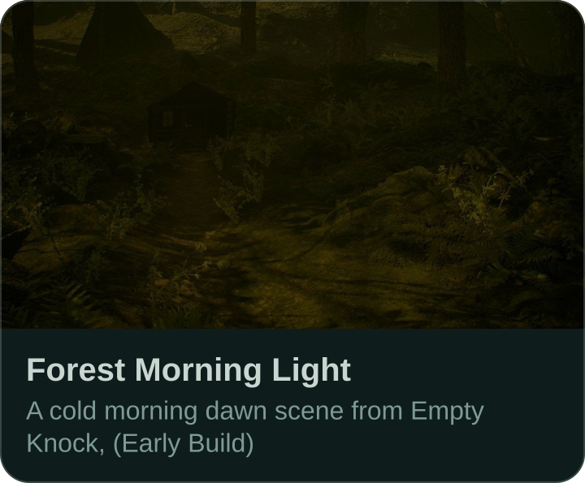
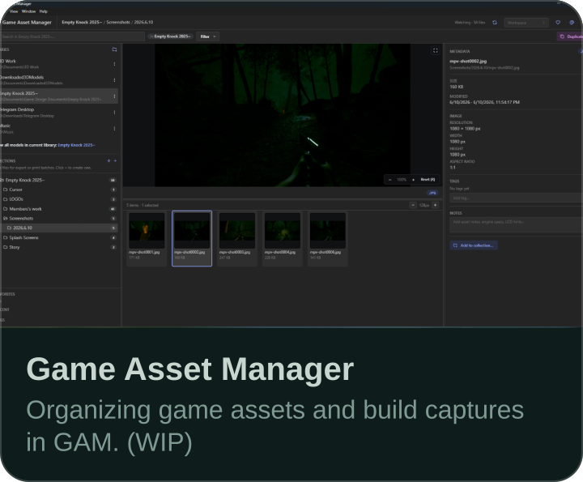

  

  <nobr>
    <!--
--></svg>" width="1.42%" /><!--
--><!--
--></svg>" width="1.42%" /><!--
--><!--
--></svg>" width="1.42%" /><!--
-->
  </nobr>

 ### Empty Knock
> A Cult Horror Game, Set in Pacific Northwest with Realistic Visuals
> Built with raw native performance in mind - focusing on actual optimization rather than using upscaling and frame generation as a crutch (though both will still be options in the settings).
>
> When standard tools aren't enough, I build my own. That led to **Game Asset Manager** - a custom desktop app built in TypeScript and React to organize and preview 3D models, textures, audio files, videos, images, and text files all in one place.

  
   
  Game Asset Manager · the tool I built for my own pipeline

  &nbsp;&nbsp;&nbsp;
  &nbsp;&nbsp;&nbsp;
  &nbsp;&nbsp;&nbsp;
  

